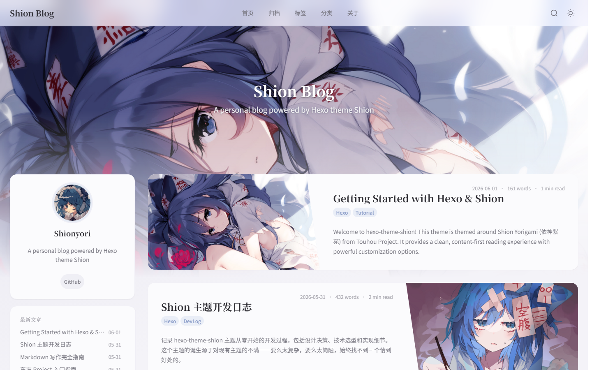

<p align="center">
  
</p>

<h1 align="center">hexo-theme-shion</h1>

<p align="center">
  A clean, content-first Hexo blog theme themed around Shion Yorigami (依神紫苑) from Touhou Project.
</p>

<p align="center">
  
  
  
</p>

---

<p align="center">
  
</p>

## ✨ Features

- 🌗 **Dark / Light mode** — auto-detect system preference with manual toggle (localStorage)
- 🌐 **Multi-language** — English, 简体中文, 繁體中文, 日本語
- 🔍 **Local search** — Fuse.js full-text search via `Ctrl+K` / `Cmd+K`
- 📑 **Table of contents** — auto-generated with IntersectionObserver scroll spy
- 💻 **Code highlighting** — highlight.js with light/dark themes, line numbers, copy-to-clipboard
- 📐 **KaTeX math** — LaTeX rendering with per-post toggle
- 🖼️ **Image features** — lazy loading, click-to-zoom lightbox, flexible `` tag plugin
- 🏷️ **Rich tag plugins** — note, image, quote, details, tabs, link cards, post link cards
- 💬 **Comments** — Giscus, Disqus, Waline, Twikoo, Valine, Gitalk, Utterances (lazy-loaded)
- 📊 **Analytics** — Google Analytics, Baidu Tongji, Busuanzi (site PV/UV)
- 🔗 **SEO** — Open Graph, Twitter Cards, JSON-LD structured data, canonical URLs
- 📖 **Reading time & word count** — CJK-aware estimation per post
- 📱 **Responsive** — mobile-first layout with slide-out sidebar
- 🎨 **Custom fonts** — override heading/body/code font families from config
- 🔼 **Back to top** — floating button with scroll-aware visibility
- 📡 **RSS ready** — auto-detects `hexo-generator-feed` and links Atom feed
- ⚠️ **Outdate warning** — configurable notice on posts older than N days
- ✨ **Entrance animations** — staggered fade-in for cards, sidebar, and post sections

## 📦 Quick Start

### Prerequisites

- [Hexo](https://hexo.io/) ≥ 8.x
- Node.js ≥ 18

### Install

```bash
cd your-hexo-site

# Via git (recommended)
git clone https://github.com/Shionyori/hexo-theme-shion themes/shion

# build
cd themes/shion
npm install & npm run build
```

### Enable

Edit your site's `_config.yml`:

```yaml
theme: shion
```

### Copy theme config

```bash
cp themes/shion/_config.yml _config.shion.yml
```

Edit `_config.shion.yml` to customize — Hexo merges this over the theme defaults.

---

## 📚 Documentation

- **[Configuration Reference](docs/configuration.md)** — all theme settings with defaults and descriptions
- **[Tag Plugins](docs/tag-plugins.md)** — ``, ``, ``, and more
- **[Development Guide](docs/development.md)** — project structure, build scripts, and contributing

### Content Organization

Recommended structure for organizing your content with this theme:

```
source/
├── _posts/
│   ├── 2026-06-01-my-post.md
│   ├── 2026-06-01-my-post/          # auto-created by `hexo new`
│   │   ├── cover.png                # post cover
│   │   ├── diagram.png              # inline illustration
│   │   └── screenshot.jpg           # inline illustration
│   └── ...
├── about/index.md
├── categories/index.md
└── tags/index.md
```

This theme works best with **post asset folders** enabled:

```yaml
# In your site's _config.yml
post_asset_folder: true
```

Cover images are resolved from the post's asset folder by default. Set `cover: cover.png` in frontmatter (or any relative path) — the theme resolves it to the post's permalink path automatically. See the [Configuration Reference](docs/configuration.md#post) for all cover-related options.

---

## 🙏 Credits

- **Shion Yorigami** (依神紫苑) — character by ZUN / Team Shanghai Alice (上海アリス幻樂団)
- Theme design inspired by modern tech blogs, especially [hexo-theme-reimu](https://github.com/D-Sketon/hexo-theme-reimu)
- Built with [Hexo](https://hexo.io/), [Sass](https://sass-lang.com/), and [TypeScript](https://www.typescriptlang.org/)
